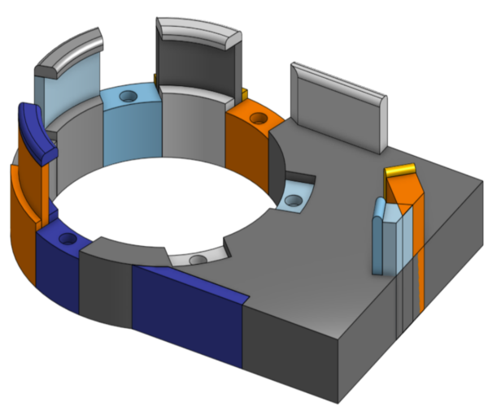

# Bionic_Wrench_Automation_Project
This repository contains the details of my final project for my Masters in Robotics at Northwestern Univeristy. This project entailed the automation of a part of the production process for the Bionic Wrench (Loggerhead Tools) and was supervised by Professor Dan Brown.

## Overview
The initial goal of this project was to observe the manufacturing process of the Loggerhead Tools Bionic Wrench and identify a bottleneck in the process that can be addressed by automation. With that goal set out, there were no set requirements on what should be automated and how it should be automated. This allowed for freedom and trust in following the design process to achieve the optimal solution to this problem.

After journey mapping the manufacturing process, giving time values for each task as well as automatibility ratings and assessments regarding what would be gained from automation, it was clear to see that the set of tasks involved in placing the wrench jaws in the wrench are both the most automatable and automating them will result in the most gain to the entire process. As such the task was set out to use/design whatever is deemed appropriate to automate this process in a way that is both accurate and fast.

The result is shown below:
    
 <iframe width="630" height="385" src="" frameborder="0" allow="accelerometer; autoplay; encrypted-media; gyroscope; picture-in-picture" allowfullscreen></iframe> 
  

As will be detailed, the mechanical design for this project was primarily done using <a href=https://www.onshape.com/ target="_blank">OnShape</a> CAD software, the construction of the rig was done using various prototyping methods such as 3D printing and Laser Cutting, a PIC32MX795F512H microcontroller was used to control the system and the relevant peripheral circuitry and coding of the microcontroller was done in C. 

## Approach
As mentioned above, the first step of this project was just to observe. Professor Brown gave me videos of the current production process for the wrench and I began to make note of each task being undertaken, how long each task was taking and how that task affects the other tasks. It was clear that the biggest bottleneck in the process was the placing of the wrench jaws in the wrench. This task represented the biggest gain from automation but also perhaps one of the most challenging steps to automate given the precise needs for placing the jaw as well as the small amount of space in the middle of the wrench in which a mechanism can actuate.

So begun the iterative process of design. The bulk of work done in this project was in mechanical design, each week brought about a new iteration of the current design as well as thoughts on a new approach. That journey can be mapped by following the different "STL" files of the various designs that were cycled through before arriving at the final stop. 

It became important to create journey maps of best case scenarios, so as to assess the approach and figure out what could be done in time as well as what could be done better.
<!--  -->

A big change in the approach came about when it was decided that using gravity to place the jaws could simplify the process by eliminating the need to actuate within the small space in the middle of the wrench. This came about as a serendipitous thought during a brainstorming session with Professor Brown. 
As such, the final approach was to use gravity to place the jaws in the wrench, with the assistance of an electromagnet and to rotate the wrench around the jig and repeat - so as to place all 6 jaws. This will be further detailed below.

## Mechanical Design

The mechanical design involved in this project was by far the most important, most complex and thus the most time consuming aspect of the project. As is the nature of design, it involved a lot of iterations as well as a few changes in approach that ultimately led to the final design. This final set up is shown below and will be further discussed later.
<!-- 
  
 -->

### Initial Designs
The two initial goals of the design, deemed to be the most important in order to achieve the end goal, were to hold the wrench in place and then subsequently to be able to place a jaw in the wrench in a manner that could be repeated 6 times - for each jaw. This led to the first iterations of the design worth mentioning.  

#### Outer Jig - Wrench Holder
It became clear that a way in which 6 jaws could be placed in a repetitive manner would be to hold the wrench in place around the center, wherein the jaw actuation would take place, and then rotate the wrench around this actuator. This led to the following design. The indentations around the circle are in there to allow for a jaw to be placed in any of those six spots. The raised bumps on either side of the circle are the to help fix the wrench in place.
<!-- 
  
 -->

This design was clearly not very good as it was not dimensioned well to hold the wrench at all. This design evolved into something that was built off of the wrench's actual dimensions. It included a bit more support for the bottom of the wrench.
<!-- 
  
 -->

This design finally became dimensioned to precisely hold the wrench open to a certain angle - so as to allow for the jaws to be placed within the wrench. It further includes some protection against th wrench falling out of the jig since the final design requires for the jig and wrench combination to be held at a 90 degree angle.
<!-- 
  
 -->

#### Inner Jig - Jaw Placement
The jaw placement designs tell a story of the two key changes of approach that completely revolutionised how the whole project would look.

The first design for the inner jig was based off of the idea that the jaws would be fed into the system from above in a uniform manner. This meant that the jaws would have to be shifted in a translational manner between left and right so as to place the jaw in the wrench. 
<!-- 
  
 -->

As can be seen in the above design, the jaw was supposed to be caught by the "jaw placer" in the middle of the jig. This would then be actuated from below in a translational manner so as to place the jaw. 

The problem encountered with this design was that the reliability of the jaw falling in the correct orientation was low and the lack of physical space in which to actuate the "jaw placer". This led to the next idea which was to feed the jaws into the system from the bottom.

This design was based off of the same principle of using a "jaw placer" in the center of the jig to place the jaws. But this time the jaws beign fed into the jig from the bottom would push against the ramp in the housing in the middle of the jig which would in turn force the jaw out of the opening and onto the "jaw placer". Subsequently, the "jaw placer" would then be actuated from below in a translational manner so as to place the jaw.
<!-- 
  
 -->

This again saw similar problems as the "feed from the top" design as the jaw still had to fall into place and the room for actuation was not improved. 

While playing around with the 3D printed models of the design, it was noticed that holding the center jig at a 90 degree angle to the wrench allowed for the jaws in the system to simply fall into place! This revelation led to the final approach used in the project.

### Final Designs - Gravity is my Friend!

## Electronics

## Code

## Future Work
